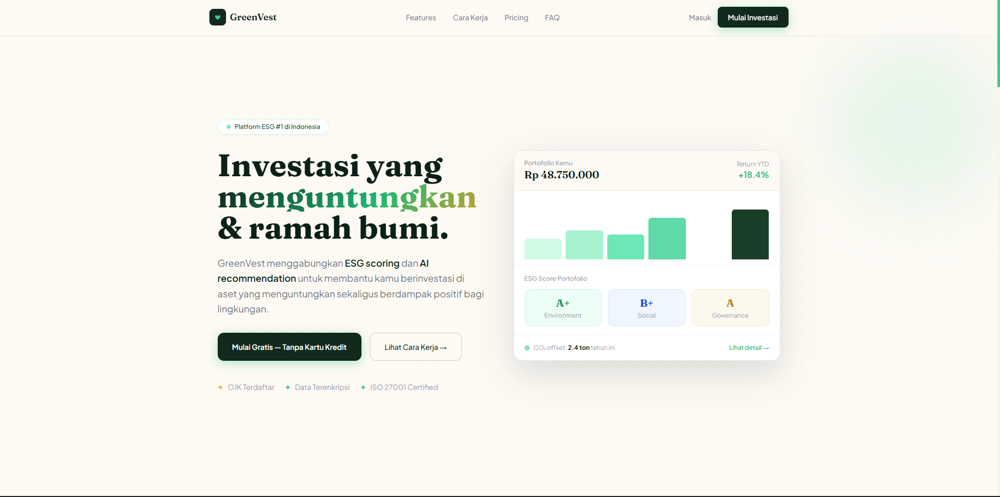

# GreenVest 🌱

> **Sustainable Investment Platform** — Investasi cerdas yang menguntungkan sekaligus berdampak positif bagi bumi.



---

## 🏷️ Tags

`Fintech / ESG Platform` &nbsp; `Industri: Sustainable Finance` &nbsp; `Target: Investor Modern & Eco-conscious Users`

---

## 📌 Tentang Project

**GreenVest** adalah landing page modern untuk platform investasi berbasis ESG (*Environmental, Social, Governance*) yang menggabungkan teknologi AI dengan sustainable finance.

Landing page ini dirancang dengan pendekatan visual **eco-premium modern** — memadukan nuansa natural, clean, dan professional untuk membangun rasa percaya kepada pengguna sejak pertama kali membuka halaman.

Project ini dibuat menggunakan:

- **HTML5**
- **Tailwind CSS CDN**
- **Custom CSS**
- **Vanilla JavaScript**

Tanpa framework frontend tambahan dan tanpa build process.

---

## ❗ Masalah yang Diselesaikan

### 1. Platform Investasi ESG Terlihat Terlalu Rumit

Banyak platform sustainable finance terlihat kompleks dan terlalu teknis bagi investor pemula. Pengguna sering kesulitan memahami manfaat ESG dan bagaimana cara memulai investasi.

### 2. Sulit Membangun Trust di Produk Finansial Baru

Dalam kategori fintech, tampilan visual sangat mempengaruhi tingkat kepercayaan pengguna. Landing page biasa tanpa identitas visual yang kuat sering gagal memberikan kesan aman dan profesional.

### 3. Landing Page Finansial Terlihat Membosankan

Mayoritas website investasi menggunakan tampilan generik:
- warna biru corporate
- tabel kaku
- UI terlalu formal

Akibatnya produk sulit diingat dan kurang memiliki emotional connection dengan pengguna.

### 4. Tidak Ada Visualisasi Dampak Investasi

Pengguna modern tidak hanya ingin profit — mereka juga ingin mengetahui dampak investasi mereka terhadap lingkungan.

Namun banyak platform belum mampu memvisualisasikan:
- ESG score
- carbon offset
- environmental impact
- sustainability metrics

dengan cara yang sederhana dan menarik.

### 5. Conversion CTA Kurang Menonjol

Landing page finansial sering terlalu fokus pada informasi teknis dan lupa mengarahkan pengguna untuk melakukan aksi seperti:
- daftar akun
- mulai investasi
- konsultasi
- mencoba demo

---

## ✅ Solusi yang Diberikan

### Eco-Premium Design System

GreenVest menggunakan kombinasi warna natural:
- forest green
- emerald
- cream
- soft gold

untuk menciptakan kesan:
- aman
- modern
- sustainable
- premium

Seluruh halaman menggunakan konsistensi:
- spacing
- typography
- radius
- shadow
- hover effect
- animation timing

---

### Hero Section yang Fokus pada Emotional Trust

Hero section dirancang untuk langsung menjawab:

> "Kenapa saya harus investasi di GreenVest?"

Dengan kombinasi:
- headline besar
- ESG positioning
- AI recommendation statement
- dashboard preview
- trust indicators

Pengguna langsung memahami value utama platform dalam beberapa detik pertama.

---

### Dashboard Mockup Interaktif

Alih-alih menggunakan screenshot statis, GreenVest menggunakan dashboard UI mockup berbasis HTML dan CSS untuk menampilkan:

- portfolio growth
- ESG score
- CO₂ offset
- investment metrics

Hasilnya:
- loading lebih ringan
- lebih fleksibel
- lebih modern
- tetap terlihat realistis

---

### Sistem Interaksi Modern

Landing page memiliki berbagai micro interaction modern:

- fade-up scroll animation
- hover card effect
- glassmorphism navbar
- accordion FAQ
- animated pulse badge
- modal authentication
- smooth scrolling

Semua dibuat menggunakan Vanilla JavaScript tanpa library eksternal.

---

### Struktur Landing Page yang Strategis

Urutan section dirancang mengikuti conversion funnel modern:

```txt
Navbar Sticky
   ↓
Hero Section
   ↓
Metrics / Social Proof
   ↓
Features Grid
   ↓
How It Works
   ↓
Pricing
   ↓
FAQ
   ↓
CTA Banner
   ↓
Footer
````

Setiap section memiliki tujuan komunikasi yang spesifik.

---

## 🎨 Design Decisions

| Aspek         | Keputusan                    | Alasan                 |
| ------------- | ---------------------------- | ---------------------- |
| Style         | Eco-premium modern           | Trust + sustainability |
| Primary Color | Forest & Emerald             | Natural + fintech feel |
| Accent        | Soft Gold                    | Premium touch          |
| Typography    | Fraunces + Plus Jakarta Sans | Elegant + readable     |
| Hero Layout   | Split layout dashboard       | Visual trust           |
| Animation     | Smooth fade-up               | Modern experience      |
| Button Style  | Rounded-xl + glow            | Friendly CTA           |
| Navbar        | Glassmorphism sticky         | Premium interaction    |

---

## 🎨 Color Palette

| Nama        | Hex       | Fungsi            |
| ----------- | --------- | ----------------- |
| Forest 900  | `#0B2016` | Background utama  |
| Forest 700  | `#1A3D28` | Surface dark      |
| Emerald 600 | `#1DB870` | CTA utama         |
| Emerald 500 | `#3DC98C` | Accent            |
| Cream 50    | `#FDFAF4` | Background terang |
| Gold 500    | `#C9A030` | Premium accent    |
| Gray Text   | `#6B7280` | Secondary text    |

---

## 🛠️ Tech Stack

| Teknologi          | Penggunaan                          |
| ------------------ | ----------------------------------- |
| HTML5              | Struktur semantik halaman           |
| Tailwind CSS CDN   | Utility styling                     |
| Custom CSS         | Animation, glassmorphism, custom UI |
| Vanilla JavaScript | Modal, FAQ, mobile menu             |
| Google Fonts       | Fraunces + Plus Jakarta Sans        |
| CSS Grid & Flexbox | Responsive layout                   |
| CSS Transitions    | Hover & scroll animation            |

---

## ✨ Fitur Utama Landing Page

* 🌱 ESG investment branding modern
* 📊 Interactive portfolio dashboard preview
* ✨ Scroll fade-up animation
* 💳 Pricing section modern
* 📱 Fully responsive layout
* 📌 Sticky glassmorphism navbar
* ❓ Interactive FAQ accordion
* 🔐 Authentication modal
* 📈 Metrics & impact visualization
* 🎨 Bento-style features layout
* 🌿 Sustainable finance visual identity

---

## 🚀 Cara Menjalankan

```bash
# Clone repository
git clone https://github.com/username/greenvest.git

# Masuk folder project
cd greenvest

# Jalankan langsung
open greenvest.html

# atau gunakan Live Server VS Code
```

Tidak membutuhkan:

* npm install
* build tools
* framework setup

Langsung jalan di browser.

---

## 📁 Struktur File

```txt
greenvest/
├── greenvest.html
├── greenvest.css
├── greenvest.js
├── preview.png
└── README.md
```

---

## 🌐 Live Demo

[🔗 [Lihat Live Demo](https://greenvest-lovat.vercel.app/)](#)


---

## 💡 Pelajaran dari Project Ini

1. Visual trust sangat penting dalam produk finansial
2. Sustainable branding bisa dibuat modern dan premium
3. Tailwind + custom CSS sangat powerful untuk landing page
4. Vanilla JavaScript masih sangat cukup untuk interaction modern
5. Hierarki section menentukan conversion rate landing page

---

## 📚 Inspirasi & Referensi

| Brand  | Inspirasi            |
| ------ | -------------------- |
| Stripe | Fintech layout       |
| Linear | Minimal interaction  |
| Notion | Clean spacing        |
| Apple  | Typography hierarchy |
| Ramp   | Modern SaaS UI       |

---

## 👤 Developer

**Putu Dio** - Web Developer

- 🌐 Portfolio: [Coming Soon](#)
- 💼 LinkedIn: [[linkedin.com/in/putudiokenneta](https://www.linkedin.com/in/putu-dio-kenneta-09818440b/)]
- 🐙 GitHub: [[github.com/PutuDio](https://github.com/PutuDio)]


---

## ⭐ Penutup

GreenVest bukan hanya sekadar landing page fintech biasa.

Project ini dirancang untuk menunjukkan bagaimana:

* visual design,
* frontend interaction,
* conversion strategy,
* dan branding

dapat digabungkan menjadi pengalaman web modern yang terasa profesional, terpercaya, dan memorable.

Jika project ini membantu atau menginspirasi, jangan lupa ⭐ repository ini.

```
```
